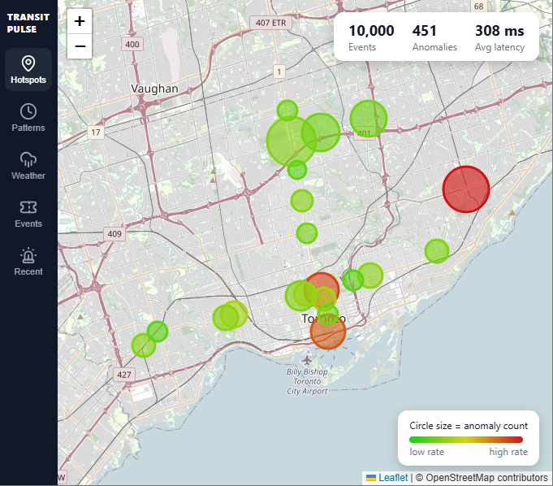
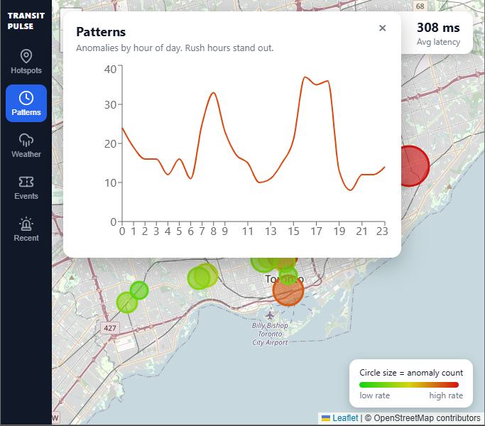
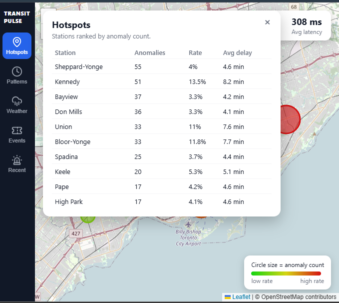
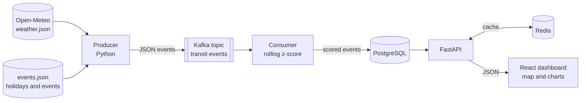
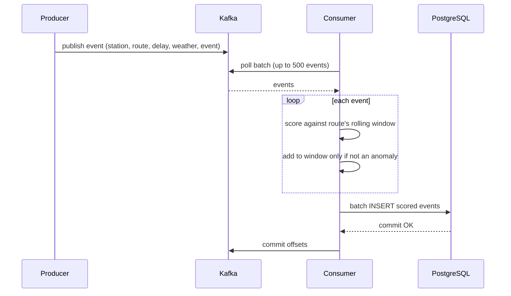
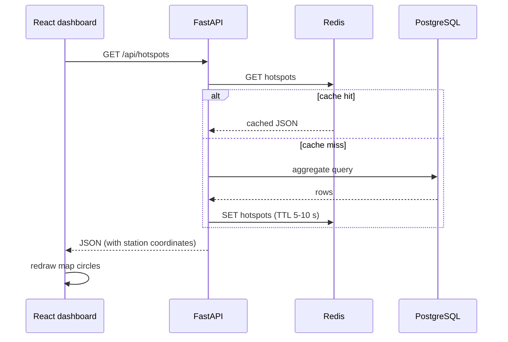
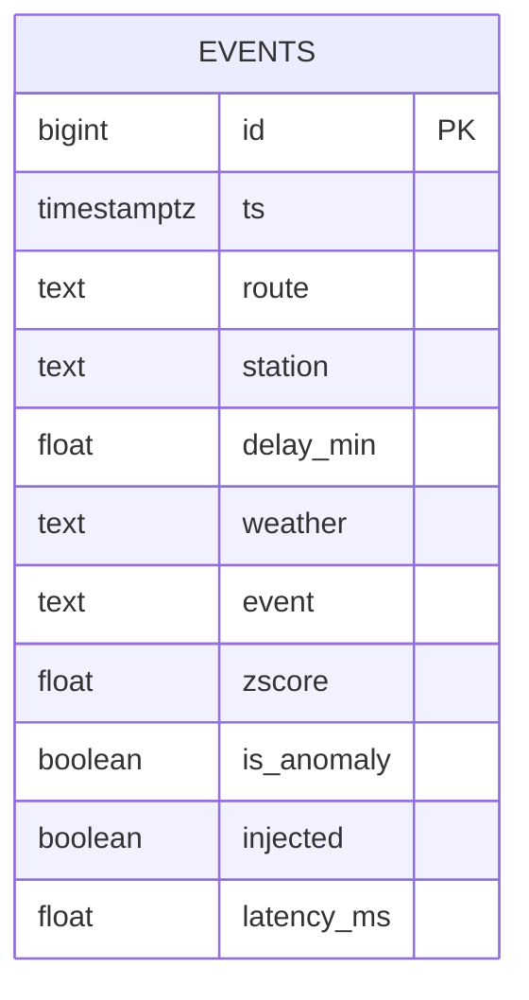
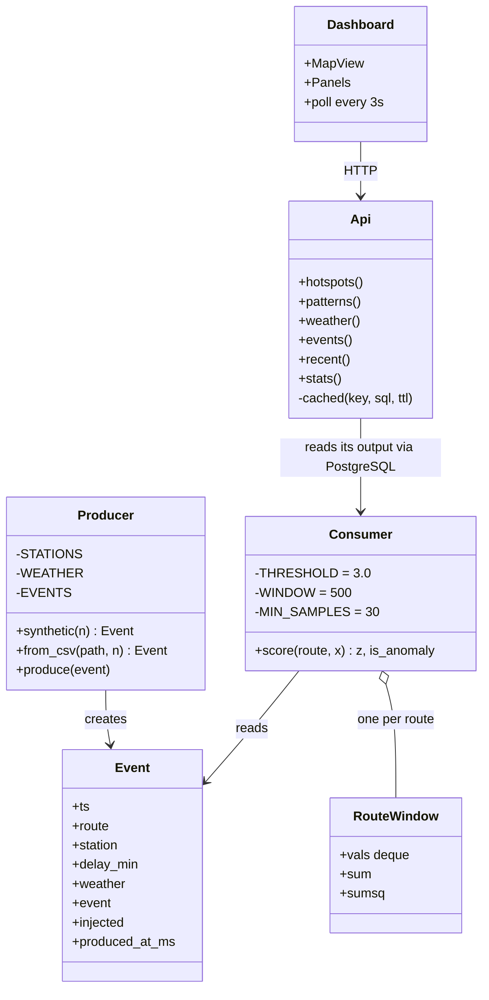

# TransitPulse

**A real-time system that watches a stream of subway delay data and automatically spots unusual delays, then shows where and when they happen on a live map.**



## What is this, in plain language?

Transit agencies produce a constant flow of data: which station, what time, how many minutes late. Most of it is normal. A few events are not, such as a 45-minute delay when the usual is 3.

TransitPulse does three things:

1. **Receives** a continuous stream of delay events (like a live feed).
2. **Decides** for each event whether it is unusually bad compared to that line's recent normal.
3. **Shows** the result on a map of Toronto, with bigger and redder circles for stations that have more or worse problems, plus charts for when delays happen, how weather affects them, and what happens on event days.

It is built the way real data platforms are built: separate pieces for ingesting data, processing it, storing it, serving it and displaying it. It handled **2 million events in about 160 seconds** on a laptop.

## Features

- Streaming anomaly detection using a rolling, per-route z-score
- Interactive map of delay hotspots (circle size = anomaly count, colour = anomaly rate)
- Recurring-pattern analysis (anomalies by hour of day, rush hours stand out)
- Weather analysis using real hourly Toronto weather from Open-Meteo
- Event-day analysis (holidays and big events vs a regular day)
- Redis caching in front of the database for fast dashboard queries
- Benchmarks for throughput, latency and detection accuracy

## Screenshots

| Hotspot map | Patterns by hour | Station ranking |
|---|---|---|
|  |  |  |

## Tech stack

| Layer | Technology | Role |
|---|---|---|
| Ingestion | Python, Apache Kafka | Producer publishes delay events to a topic |
| Processing | Python consumer | Scores every event with a rolling z-score |
| Storage | PostgreSQL | Stores every scored event |
| Caching | Redis | Short-lived cache for dashboard queries |
| API | FastAPI | Serves hotspots, patterns, weather and events |
| Frontend | React, Vite, Leaflet, Recharts | Map-first dashboard |
| Infrastructure | Docker Compose | Runs Kafka, PostgreSQL and Redis locally |

## Architecture



**How an event moves through the system:** the producer creates an event and sends it to Kafka. The consumer reads it, compares it with the recent normal for that route, labels it normal or anomalous, and saves it to PostgreSQL. The dashboard asks the API for summaries every 3 seconds. The API checks Redis first and only queries PostgreSQL if the answer is not cached.

### Sequence diagram: ingesting and scoring an event



Offsets are committed **only after** the database write succeeds, so a crash cannot silently lose events (at-least-once delivery).

### Sequence diagram: loading the dashboard



### Data model



`injected` is the ground-truth label from the synthetic generator. It exists only so precision and recall can be measured.

### Class diagram

The project is written as small scripts rather than classes, so this diagram shows the main modules and the data structures they pass around.



## How the anomaly detection works

Each route keeps a rolling window of its last **500 normal delays**. For every new event the consumer computes:

```
z = (delay - mean of window) / standard deviation of window
```

If `z > 3.0`, the event is flagged as an anomaly. Two design choices keep it honest:

- **Anomalies are kept out of the baseline**, so a bad day does not teach the detector that bad is normal.
- **No scoring until 30 samples exist** for a route, so the first few events do not produce meaningless scores.

Running sums make each score O(1), which is what lets it keep up with about 12,500 events per second.

## Simulated vs real data

Please read this before looking at the charts.

| Part | Real or simulated |
|---|---|
| Hourly Toronto weather (rain, snow, clear) | **Real**, from Open-Meteo historical data |
| Holiday and event dates | **Real** calendar dates |
| Delay events | **Simulated**, generated by `producer/producer.py` |
| Rush-hour effect (2x anomaly odds at 7-9 and 16-18) | **Simulated**, built into the generator |
| Weather effect (snow 2x, rain 1.4x anomaly odds) | **Simulated**, built into the generator |
| Event-day effect (1.6x anomaly odds) | **Simulated**, built into the generator |
| Station coordinates | Approximate, for demo purposes |

The weather and event effects are injected on purpose so the pipeline has patterns to find. The charts show that **the system can detect and surface such relationships**. They do not show that snow causes TTC delays. The producer can also replay a real delay CSV (`data/ttc.csv`), in which case the same dashboard would show whatever the real data contains.

## Benchmarks

Measured on a single laptop (Windows, Docker Desktop for Kafka, PostgreSQL and Redis), synthetic data, threshold z > 3.0.

### Scale test: 2 million events

| Metric | Result |
|---|---|
| Events processed | 2,000,000 |
| Wall time | 159.9 s |
| End-to-end throughput | ~12,500 events/sec |
| True positives | 66,197 |
| False positives | 3,694 |
| False negatives | 0 |
| Precision | 0.95 |
| Recall | 1.00 |

This run used the first version of the generator (random anomalies, no weather, rush-hour or event effects). Latency is not reported for it: at unlimited rate the producer fills Kafka faster than the consumer drains it, so the measured delay is queueing, not processing time.

### Latency: paced run

`python bench/bench.py 10000 500` (actual producer rate about 450 events/sec, current generator)

| Metric | Result |
|---|---|
| p50 latency | 308 ms |
| p95 latency | 546 ms |
| Precision | 0.97 |
| Recall | 1.00 |
| TP / FP / FN | 439 / 12 / 0 |

Latency runs from the producer timestamp to the moment the consumer scores the event, so it includes Kafka transit and consumer batching.

### Accuracy vs threshold

| Threshold | Precision | Recall |
|---|---|---|
| 3.0 | 0.97 | 1.00 |

Lower thresholds catch more anomalies but flag more normal events. Higher thresholds do the opposite.

Full notes are in [`bench/results.md`](bench/results.md).

## Getting started

### Prerequisites

- [Docker Desktop](https://www.docker.com/products/docker-desktop/) (running)
- Python 3.11 or newer
- Node.js LTS

### 1. Clone and install

```powershell
git clone https://github.com/saheli24/TransitPulse.git
cd TransitPulse
python -m venv .venv
.venv\Scripts\Activate.ps1
pip install -r requirements.txt
```

On macOS or Linux, activate with `source .venv/bin/activate` instead.

### 2. Start Kafka, PostgreSQL and Redis

```powershell
docker compose up -d
docker compose ps
```

All three should show as running. Give Kafka about 15 seconds to finish starting.

### 3. Download the real weather data (one time)

```powershell
python data/fetch_weather.py
```

This saves about 18,000 hourly records to `data/weather.json`. No API key needed.

### 4. Run the pipeline

Use a separate terminal for each (activate the venv in the Python ones).

```powershell
# Terminal 1: consumer
python consumer/consumer.py

# Terminal 2: API
uvicorn api.main:app --reload --port 8000

# Terminal 3: dashboard
cd dashboard
npm install
npm run dev
```

### 5. Generate data

```powershell
# Terminal 4: one-off load of 200,000 events (about 75 days of simulated data)
python bench/bench.py 200000 0
```

Open **http://localhost:5173**. Click the sidebar buttons to open the Hotspots, Patterns, Weather, Events and Recent panels.

### Re-running benchmarks cleanly

Stop the consumer, then reset Kafka and the table:

```powershell
docker compose exec kafka /opt/kafka/bin/kafka-topics.sh --bootstrap-server localhost:9092 --delete --topic transit-events
docker compose exec kafka /opt/kafka/bin/kafka-topics.sh --bootstrap-server localhost:9092 --create --topic transit-events
docker compose exec postgres psql -U transit -d transitpulse -c "TRUNCATE events;"
```

Change the detection threshold with `$env:THRESHOLD = "2.5"` before starting the consumer.

## API endpoints

| Endpoint | Returns |
|---|---|
| `GET /api/hotspots` | Per-station anomaly count, rate, average delay and coordinates |
| `GET /api/patterns` | Anomalies and average delay by hour of day |
| `GET /api/weather` | Anomaly rate by weather type |
| `GET /api/events` | Anomaly rate on event days vs a regular day |
| `GET /api/recent` | The 15 most recent anomalies |
| `GET /api/stats` | Total events, anomalies and average latency |

Interactive docs are available at http://localhost:8000/docs.

## Project structure

```
TransitPulse/
├── producer/producer.py     # generates or replays events into Kafka
├── consumer/consumer.py     # rolling z-score anomaly detection
├── api/main.py              # FastAPI endpoints with Redis caching
├── dashboard/               # React + Leaflet + Recharts front end
├── db/schema.sql            # PostgreSQL schema
├── data/
│   ├── fetch_weather.py     # downloads Open-Meteo weather
│   └── events.json          # holiday and event dates
├── bench/
│   ├── bench.py             # throughput, latency, precision/recall
│   └── results.md           # recorded results
├── docs/                    # screenshots
└── docker-compose.yml       # Kafka, PostgreSQL, Redis
```

## Limitations

- Delay events are synthetic, so precision and recall measure agreement with injected labels, not real incidents.
- Results come from one machine and will vary with hardware.
- The single consumer and single Kafka partition were enough for these runs. Scaling out would mean more partitions and consumers.
- The dashboard polls every 3 seconds rather than using WebSockets.
- Station coordinates are approximate.

## Roadmap

- Replace the Python consumer with an Apache Spark Structured Streaming job and benchmark both
- Validate on a real TTC delay dataset
- Threshold sweep (2.0, 2.5, 3.0) in the results table
- GitHub Actions CI with linting and tests

## License

MIT
